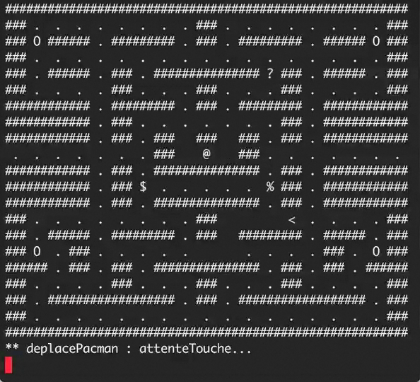

# Prolog-pacman

Student project I wrote in 2004 with C. Aussourd.

Demo: [Pacman in prolog](https://www.youtube.com/watch?v=mSgza7elZt8) (YouTube)

## How to run and play

- install [SWI-Prolog](http://www.swi-prolog.org/Download.html)
- run `./pacman.sh`
- move pacman up/down/left/right by pressing W/S/A/D then ENTER

## Next steps

- [ ] Find a way to make it work directly in the browser
- [ ] Translate comments and display to English
- [ ] Remove the need to press ENTER after each direction command

Pull requests are welcome!
